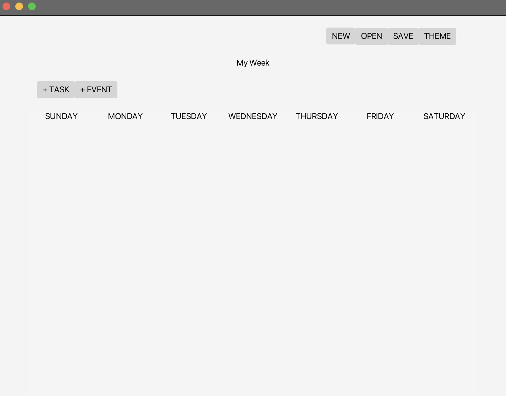

# 3500 PA05 Project Repo

[PA Write Up](https://markefontenot.notion.site/PA-05-8263d28a81a7473d8372c6579abd6481)

()

Our Bullet Journal application helps you organize your weeks with all your tasks and events. With the
click of a button, you can create a task or event for any given day. Our program provides a total count for
your week's total tasks and events along with a percentage of tasks completed. Each day also provides the number of
tasks left to complete and a daily progress bar. You can open and save your .bujo files, as well as open
multiple windows, change the layout, and choose from 4 themes. All of these features are supported with keyboard
shortcuts and menu bar functionality. The name of your week, max daily tasks, and max daily events are all customizable
by clicking on their label.

Keyboard shortcuts:
cmd+s Save
cmd+shift+s Save As
cmd+t Task
cmd+e Event
cmd+n New
cmd+m Theme
cmd+o Open

Themes:
Default
Vithya's Theme
Sree's Theme
Grace's Theme

Single Responsibility
Our program extensively used the single-responsibility principle. This is especially true for all of the EventHandler
subclasses we created. They each exist to handle an event of a specific button or interactive label. The BujoGuiView
only decides which layout to load and then loads it. The Driver class's only job is to launch the application. The
BujoReader class is only used to read bujo files. The Week, Item, Event, Task, Day, and Json classes exist to represent
a single set of data and deal with their necessary functions only.

Open/Closed
Our program is open for extension, but closed for modification through our use of interfaces. Our GuiView interface
defines one load method, and our BujoGuiView class implements. If someone else wanted to load a scene in a slightly
different way, they could also implement the GuiView interface. We declare an abstract Item class for the items that
can be added to a week. Our Event and Task classes define 2 such items. Someone could extend the Item class to create
another type that could be added to a week with the same basic features, but they cannot edit the minimum
requirements set by the Item class.

Liskov Substitution
Each of the handlers for buttons and interactive labels required the use of classes that implemented the EventHandler
class. The buttons and interactive labels all called the setOnAction method which accepted one of these subclasses
of the EventHandler class which all override the handle method. In addition, the fxml containers we used to store
information for a day are all of type Pane. Based on horizontal or vertical layout selection, these containers are 
either VBoxes or HBoxes. In our program, the Panes are calling methods, and since VBoxes and HBoxes extend that class,
it does not break the program when their runtime types are VBoxes or HBoxes instead of Panes.

Interface Segregation
Each of the classes in our program are meant to contain the methods that they do. There is no such instance where
a class is forced to implement code that it doesn't need. An example of how we avoided this is through our abstract
Item class. All Items have names and descriptions, so the constructors and setters/getters for these fields are
concrete. The Task and Event subclasses contain names and descriptions as well as a few fields not shared. Instead of
making the Item class contain a name and description as well as all of the fields and setters/getters of the Event
and Task classes, the Event and Task classes implement these methods separately so that all of their code is relevant
to the class.

Dependency Inversion
Our program uses dependency inversion through a lot of dependency injection. In many of the handlers and classes,
we pass in a Week or Controller. This allows us to have access to all of the fields and methods of those classes in
a separate class. Instead of having to create new objects from scratch within a class, we can pass in existing objects
and utilize the code that way.

Extension
Our program can be extended to implement different starting days. All of the information for each day is displayed in
a Pane. With the addition a new dropdown menu and a new EventHandler subclass, we can easily restructure the
week by reordering how the day Panes are ordered in the larger Pane. This information can also simple be stored to the
bujo file. Since the WeekJson takes in a List<Day> to represent the week, changing the order of the days in the list
will automatically guarantee that the writing to the bujo file and reloading will produce the correct day sequence.

Photo attributions:
https://www.redbubble.com/i/art-board-print/Blue-Puffle-by-awoods6524/35473684.5E8EA
https://www.nicepng.com/ourpic/u2q8w7q8e6i1y3o0_green-puffle-art-club-penguin-puffle-verde/
https://www.seekpng.com/ipng/u2w7u2w7t4y3y3t4_orange-puffle-cute-guy-sad-puffle/
https://www.pinterest.com/pin/cute-pink-puffle--564005553307810904/
https://www.pinterest.com/pin/456059899742445387/
https://www.pinterest.com/pin/the-red-puffle-loves-surfing-and-can-be-bought-in-pet-store-by-anyone--455848793507416323/
https://www.clipartmax.com/middle/m2i8i8Z5d3G6N4H7_catchin-waves-dark-black-penguin-club-penguin-black-penguin/
https://clubpenguinrewritten.fandom.com/wiki/Yellow_Puffle

